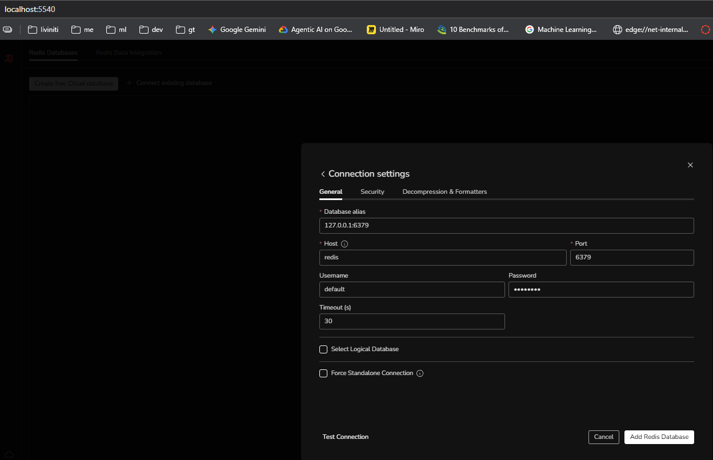

# PBM-Claim-AI-Investigation-System
Agentic AI PBM Claim Investigate System

# How to Use
Run `docker compose up` to start the infrastructure dependencies.

# Notes:
Check ollama model version: `docker exec ollama ollama model list` or [localhost:11434/api/models](http://localhost:11434/api/models)
Check ollama server version: `docker exec ollama ollama --version` or [localhost:11434/api/version](http://localhost:11434/api/version)
Using RedisInsight: go to [localhost:5540](http://localhost:5540) make sure to change Host to `redis` and password to `redis123` to connect.
